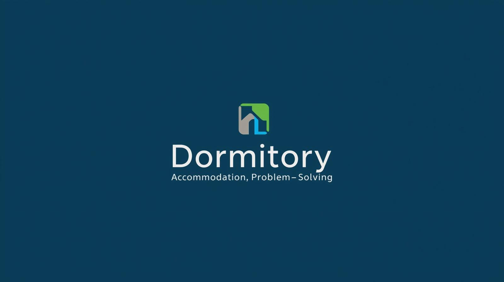
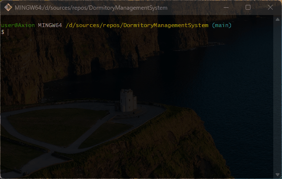

# 🌆 DormitoryManagementSystem
Providing accommodation services for university students

## 💻 About program
*This program was created for dormitories and is intended to prevent inconveniences in student accommodation.*

*You can manage available rooms, add or remove student information.*

### 🪟 Preview

### ⚙️ Technologies
 

## 🧑‍💻 I worked on it
- *OOP principles: Abstraction, Encapsulation, Inheritance, Polymorphism*
- *Elements OOP: classes, objects, interfaces, properties*
- *Classes: Console, ConsoleColor, user-defined classes*
- *Data types: int, string, bool*
- *Collections: array*
- *Strings: Regular, Interpolation*
- *Looping statements: for, do while, foreach*
- *Condition statements: if else, switch*
- *Keywords: break, continue, ref*

## 🤝 Future development
*Adding a database gives priority*

*Instead of clearing the room, take out the students one by one*

*View the program as a whole building. That is, there is the possibility of adding rooms*